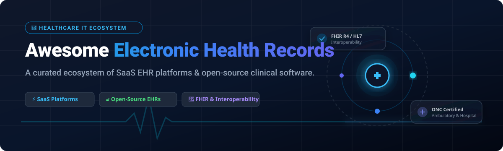

# 🏥 Awesome Electronic Health Records (EHR) Ecosystem 🚀

 

**A curated, production-ready directory of enterprise SaaS EHR platforms, practice management suites, and open-source clinical software.**

*Focused on Clinical Documentation, Practice Management, FHIR Interoperability, HIPAA Compliance & Patient Data Ownership.*

📅 **Last updated: September 2026**

---

## 📌 Overview & Market Intelligence

The global **Electronic Health Records (EHR)** market size is estimated at **~$34.5 Billion** in 2026 and is projected to reach **~$48.8 Billion** by 2030. The market structure exhibits a **split market dynamic**: the enterprise hospital segment is **highly concentrated** (dominated by Epic and Oracle Health), whereas the ambulatory, specialty, and international clinic segments remain **moderately fragmented** with numerous cloud SaaS providers and self-hosted open-source alternatives.

---

## 📑 Table of Contents

- [⚡ SaaS & Hosted EHR Platforms](#-saas--hosted-ehr-platforms)
- [🔓 Open-Source GitHub Projects](#-open-source-github-projects)
- [🏗️ Architectural Frameworks](#️-architectural-frameworks)
- [🤝 How to Contribute](#-how-to-contribute)
- [💖 Support & Sponsorship](#-support--sponsorship)
- [📈 Star History](#-star-history)
- [⚠️ Disclaimer](#️-disclaimer)

---

## ⚡ SaaS & Hosted EHR Platforms

Below is a tabular overview of top enterprise SaaS electronic health record platforms, sorted by **Company Size / Valuation** in descending order.

| Platform | Company Size / Valuation | Starting Pricing | Free Tier / Trial Limit | Key Features & Focus |
| :--- | :--- | :--- | :--- | :--- |
| **[Oracle Health (Cerner)](https://www.oracle.com/health/)** | 🏢 **$370B+ Market Cap** (Oracle Parent) | $1,500/provider/month (Enterprise tier) | 30-day sandbox demo environment with synthetic patient datasets | Enterprise hospital EHR, laboratory & radiology integration, population health management. |
| **[Epic Systems](https://www.epic.com/)** | 🏢 **$10B+ Annual Revenue** (Private, ~$40B Est. Valuation) | $1,200/provider/month base + implementation fees | 30-day developer sandbox via Epic on FHIR API portal | Market leader in enterprise U.S. health systems, MyChart patient portal, Care Everywhere interoperability. |
| **[athenahealth](https://www.athenahealth.com/)** | 🏢 **$17B Valuation** (Private Equity) | 4% to 7% of monthly practice collections | 14-day guided cloud software walkthrough trial | Cloud-based ambulatory EHR, integrated revenue cycle management, network-based billing. |
| **[Meditech](https://www.meditech.com/)** | 🏢 **~$500M+ Annual Revenue** (Private) | $600/provider/month (Expanse Cloud) | 30-day virtual product demonstration portal | Community hospital EHR, operational and financial modules, Expanse web platform. |
| **[NextGen Healthcare](https://www.nextgen.com/)** | 🏢 **$1.8B Valuation** (Acquired by Thoma Bravo) | $399/provider/month | 14-day free trial for NextGen Office | Multi-specialty ambulatory practice management, telehealth, population health analytics. |
| **[eClinicalWorks](https://www.eclinicalworks.com/)** | 🏢 **$1.5B+ Valuation** (Private) | $449/provider/month (EHR + Practice Management) | 14-day online interactive product test drive | Small-to-midsize ambulatory EHR, healow patient engagement app, e-prescribing. |
| **[Altera Digital Health](https://www.alterahealth.com/)** | 🏢 **$800M+ Valuation** (N. Harris Computer Subsidiary) | $750/provider/month | 14-day enterprise sales sandbox trial | Paragon & Sunrise EHR portfolios, inpatient clinical automation, analytics. |
| **[DrChrono](https://www.drchrono.com/)** | 🏢 **$300M+ Valuation** (EverCommerce Subsidiary) | $199/provider/month (Prometheus Tier) | 30-day full feature free trial (no credit card required) | iPad-native EHR, customizable clinical form builder, medical billing marketplace API. |
| **[CureMD](https://www.curemd.com/)** | 🏢 **$150M+ Valuation** (Private) | $295/provider/month | 14-day personalized sandbox demo trial | Specialty-focused cloud EHR, workflow automation, clinical decision support. |
| **[Practice Fusion](https://www.practicefusion.com/)** | 🏢 **$100M+ Valuation** (Veradigm Subsidiary) | $149/provider/month (annual commitment) | 14-day unrestricted free trial | Cloud EHR for independent practices, charting, e-prescribing, lab connections. |

---

## 🔓 Open-Source GitHub Projects

The following list contains open-source EHR platforms, FHIR servers, and hospital management frameworks, sorted by **GitHub Stars_Count** in descending order.

- **[ERPNext](https://github.com/frappe/erpnext)**  🌟 **~19,000+ stars**
  Comprehensive open-source enterprise resource planning system with a dedicated Healthcare Module (patient appointments, clinical procedures, vital signs logging, lab test management, and medical billing). Written in Python/Frappe Framework.

- **[HospitalRun](https://github.com/HospitalRun/hospitalrun-frontend)**  🌟 **~6,900+ stars**
  User-friendly open-source EHR and hospital information system tailored for developing world healthcare facilities. Features an offline-first architecture for remote clinics with intermittent internet connectivity.

- **[OpenEMR](https://github.com/openemr/openemr)**  🌟 **~5,500+ stars**
  The most widely deployed open-source EHR and medical practice management platform. **ONC Certified Ambulatory EHR**. Includes patient charting, e-prescribing, ANSI X12 billing, patient portal, clinical decision support rules, and full FHIR R4 API support.

- **[Medplum](https://github.com/medplum/medplum)**  🌟 **~2,700+ stars**
  Modern developer-first head-less EHR and FHIR-native health data platform. Provides TypeScript SDKs, React component libraries, automated compliance tools, and secure patient data repositories for building custom medical apps.

- **[HAPI FHIR](https://github.com/hapifhir/hapi-fhir)**  🌟 **~2,400+ stars**
  The gold-standard open-source Java implementation of the HL7 FHIR (Fast Healthcare Interoperability Resources) specification. Essential backend framework for healthcare interoperability and EHR data integration pipelines.

- **[OpenMRS Core](https://github.com/openmrs/openmrs-core)**  🌟 **~1,000+ stars**
  Enterprise open-source medical record system platform designed specifically for resource-constrained environments. Features a modular architecture used by national health delivery systems across Africa and Asia.

- **[Open Hospital](https://github.com/informatici/openhospital)**  🌟 **~504+ stars**
  Lightweight hospital management software developed by Informatici Senza Frontiere (IT Without Borders) for rural hospitals in developing nations. Manages patient records, lab testing, pharmacy, and OPD/IPD workflows.

- **[GNU Health](https://github.com/gnuhealth/gnuhealth)**  🌟 **~350+ stars**
  Free/Libre Health and Hospital Information System backed by the GNU Project. Offers hospital management, electronic medical records, laboratory information system (LIMS), and public health epidemiology tracking.

- **[Mere Medical](https://github.com/cfu288/mere-medical)**  🌟 **~250+ stars**
  Open-source offline-first Personal Health Record (PHR) application. Allows patients to aggregate, view, and control their health data from Epic, Cerner, and DrChrono via SMART on FHIR without storing data on third-party servers.

- **[LibreHealth EHR](https://github.com/LibreHealthIO/lh-ehr)**  🌟 **~238+ stars**
  FOSS EHR platform designed for modularity and modern developer usability. Features clinical documentation, practice management, and patient portal capabilities.

- **[Bahmni](https://github.com/Bahmni/bahmni-core)**  🌟 **~170+ stars**
  Integrated hospital management system combining OpenMRS, Odoo, and OpenELIS into a single intuitive web interface for low-resource hospital settings.

- **[OSCAR EMR](https://github.com/oscar-emr/oscar)**  🌟 **~120+ stars**
  Open-source EMR platform originally developed by McMaster University for Canadian primary care practices. Known for strict security controls, 2FA, and customizable clinical templates.

---

## 🏗️ Architectural Frameworks

When architecting a custom digital health application or hospital deployment:
- 🏥 **Core Clinical EHR**: Deploy **OpenEMR** (for ONC compliance and outpatient clinics) or **Bahmni / OpenMRS** (for inpatient hospital systems).
- 🔄 **Data Interoperability**: Implement **HAPI FHIR** or **Medplum** as the FHIR R4 standard translation and API layer.
- 📱 **Patient Portal & Ownership**: Utilize **Mere Medical** for client-side PHR data aggregation via SMART on FHIR.
- 🔐 **Compliance & Security**: Ensure database level encryption at rest (Transparent Data Encryption / LUKS), SSL/TLS in transit, and execute BAAs with cloud infrastructure providers (AWS / GCP / Azure).

---

## 🤝 How to Contribute

Contributions are welcome! Please follow these simple guidelines:
1. Fork the repository.
2. Add or update entries in `README.md` keeping formatting consistent.
3. Ensure links, pricing details, or Stars_Counts are accurate.
4. Submit a Pull Request with a short summary of changes.

---

## 💖 Support & Sponsorship

If you find this repository helpful for your healthcare IT research, clinical software development, or informatics projects, please consider supporting the project!

- 🌟 **Star this repository** to help others discover it.
- 🍴 **Fork it** to customize it for your organization.
- 📢 **Share it** with fellow healthcare developers and informatics practitioners.
- ☕ **Buy me a coffee**: Support ongoing open-source curation on the [GitHub Sponsor Dashboard](https://github.com/sponsors/ishandutta2007).

---

## 📈 Star History

---

## ⚠️ Disclaimer

- This is a **community-curated list** for informational and research purposes.
- Electronic Health Records process Protected Health Information (PHI). Ensure full compliance with HIPAA, GDPR, HITECH, and regional privacy regulations before deploying any system in a clinical production environment.
- **Open-source security note**: While platforms like OpenEMR and OpenMRS are production-proven, ensure robust server-level encryption, access controls, and audit logs are configured during deployment.

---

  Built with ❤️ for healthcare IT teams, clinical software engineers, and health informatics researchers.

